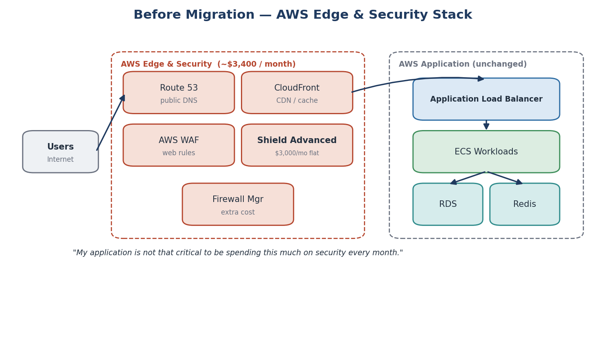
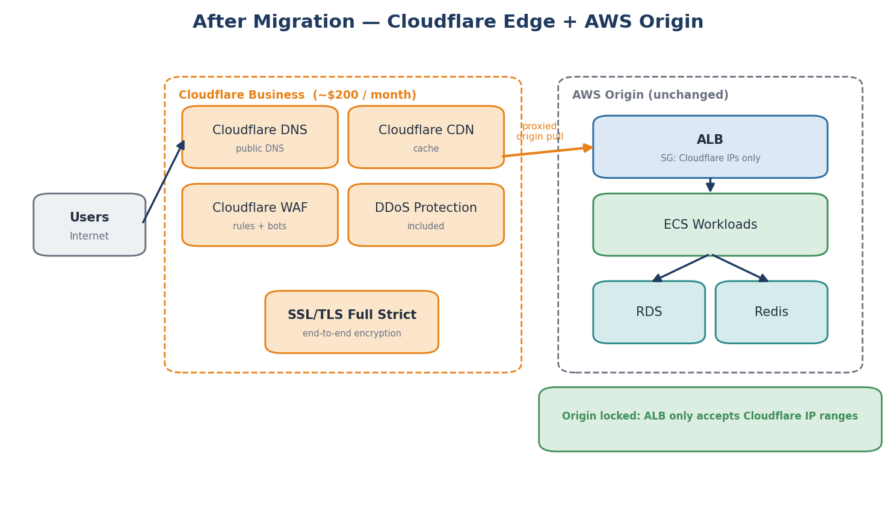
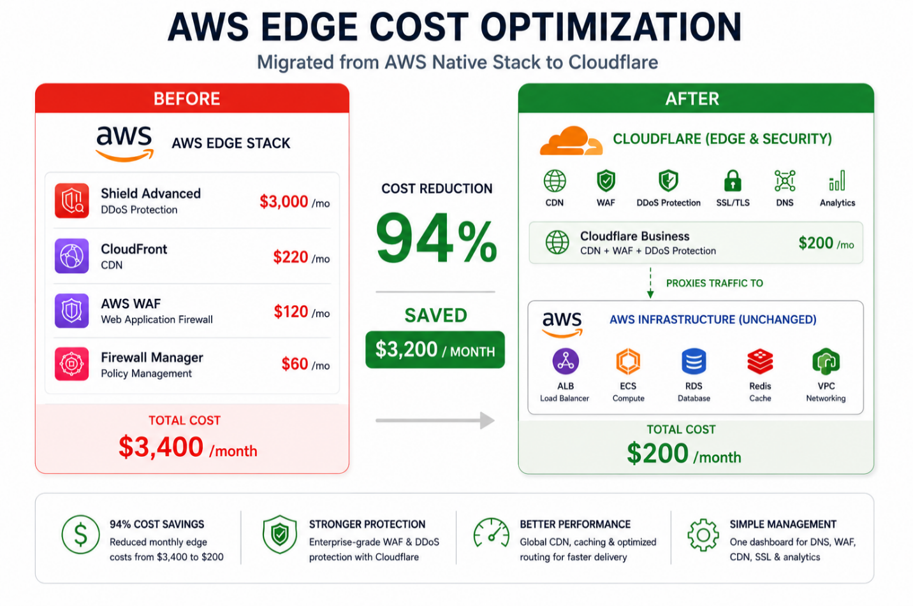
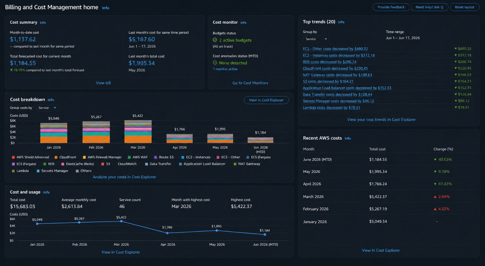

# AWS CloudFront, WAF and Shield Advanced to Cloudflare Migration

### CDN, DDoS Protection and Cost Optimization

**Role:** Senior DevOps & AWS Cloud Engineer

---

## Architecture

*Before Migration - AWS Edge and Security Stack*

---

*After Migration - Cloudflare Edge with AWS Origin*

---

## Overview

The client was a non-technical SaaS founder paying over $3,400 per month just for the edge and security layer, before any application or database costs. The biggest driver was AWS Shield Advanced at $3,000 per month flat, a fixed fee regardless of traffic volume or whether any attack ever occurs. It is designed for high-value targets expecting sustained volumetric DDoS attacks. For a growing SaaS startup, it was overkill.

The goal was to right-size the edge protection to match the client's actual risk level without touching any of the working application infrastructure on AWS. The edge layer was migrated to Cloudflare Business at around $200 per month, reducing the monthly edge bill by approximately 94 percent.

**Engagement at a glance:**

|-------------------|-----------------------------------------|
| Edge cost before  | ~$3,400 per month                       |
| Edge cost after   | ~$200 per month                         |
| Cost reduction    | ~94% (~$3,200/month saved)              |
| Application stack | Fully unchanged on AWS                  | 
| Key safeguard     | ALB locked to Cloudflare IP ranges only |

---

## The Challenge

The client's edge stack had been built for rapid growth and enterprise-grade protection from day one. As the business evolved, the protection level had outgrown what the application actually needed at its current scale. The client's own words: "My application is not that critical to be spending this much on security every month."

| Service          | Role                          | Monthly Cost                        |
|------------------|-------------------------------|-------------------------------------|
| Shield Advanced  | Managed DDoS protection       | $3,000 flat regardless of traffic   |
| CloudFront       | CDN and caching               | Usage-based edge delivery           |
| AWS WAF          | Web application firewall      | Per-rule and per-request charges    |
| Firewall Manager | Centralized policy management | Policy and config tracking overhead |
| Route 53         | Public DNS                    | Hosted zones and queries            |

Shield Advanced dominated the bill. Firewall Manager added further cost for centralized policy management that a single-account setup did not need.

---

## What Moved vs What Stayed

The design principle was simple: move only the public edge layer and leave the application completely untouched.

| Moved to Cloudflare                    | Stayed on AWS                             |
|----------------------------------------|-------------------------------------------|
| Public DNS (from Route 53)             | Application Load Balancer (ALB)           |
| CDN and caching (from CloudFront)      | ECS workloads                             |
| WAF rules (from AWS WAF)               | RDS and Redis                             |
| DDoS protection (from Shield Advanced) | VPC, security groups, internal networking |
| SSL/TLS and traffic visibility         |                                           |

---

## Why Cloudflare Business

Cloudflare Business at around $200 per month was chosen because it covered all the client's real needs without the cost of an enterprise plan.

| Need                 | How Cloudflare Business covers it                         |
|----------------------|-----------------------------------------------------------|
| DDoS protection      | Included as standard, no separate flat fee                |
| WAF and custom rules | Managed rulesets plus custom firewall rules               |
| CDN and caching      | Global CDN with configurable cache rules                  |
| SSL/TLS              | Full Strict mode for end-to-end encryption                |
| Visibility           | One dashboard for traffic, threats, and cache performance |

This was not about removing security. It was about matching the level of protection to the client's actual risk. Cloudflare Business covers a growing SaaS platform's needs at a fraction of the cost of Shield Advanced.

---

## Migration Strategy

The migration was planned to be careful and fully reversible. WAF rule parity was the most delicate part and came first. Nothing touched production until everything had been verified on a sandbox.

| Phase            | What happened                                                                                |
|------------------|----------------------------------------------------------------------------------------------|
| 1 - Map          | Map every existing AWS WAF rule to its Cloudflare equivalent for full parity                 |
| 2 - Build        | Set up the Cloudflare zone, import DNS, configure SSL/TLS, cache rules, and WAF              |
| 3 - Test         | Verify DNS, caching, WAF, SSL, and origin routing on a sandbox before any real traffic moved |
| 4 - Cutover      | Move nameservers to Cloudflare, then lock the ALB to Cloudflare IP ranges                    |
| 5 - Decommission | Unsubscribe Shield Advanced, then remove Firewall Manager and CloudFront                     |

---

## Implementation

### WAF Rule Mapping

Every existing AWS WAF rule was recreated in Cloudflare with full parity: managed rule groups, custom rules, rate limiting, IP allow/block lists, country-based rules, and bot protection. This was the most careful part of the work and is documented in full in the WAF Rule Mapping document in the `docs/` folder.

| AWS WAF             | Cloudflare WAF                      |
|---------------------|-------------------------------------|
| Managed rule groups | Managed Rulesets (OWASP/Cloudflare) |
| Custom rules        | Custom firewall rules               |
| Rate-based rules    | Rate limiting rules                 |
| IP set allow/block  | IP Access rules and lists           |
| Geo match rules     | Country-based rules                 |
| Bot Control         | Bot Fight and Bot Management        |

### Zone, DNS and SSL/TLS

The Cloudflare zone was created, DNS records were imported to match the existing configuration, and SSL/TLS was set to Full Strict mode so certificates are validated end-to-end from the user, through the Cloudflare edge, to the AWS ALB origin. CDN cache rules were configured to match the caching behavior CloudFront had provided.

### Sandbox Testing

Before touching production, everything was tested on a sandbox. DNS records, CDN caching rules, WAF rulesets, SSL, and origin routing were all verified while real traffic still flowed through AWS.

### Origin Protection

After cutover, the ALB security group was locked down to accept traffic only from Cloudflare IP ranges. Without this step, an attacker could bypass Cloudflare and hit the AWS origin directly. This is the step many people miss.

### Cutover and Decommissioning

Nameservers were moved to Cloudflare and the ALB was immediately locked to Cloudflare IP ranges. Shield Advanced was handled carefully because it carries a subscription commitment. The cancellation was timed around the client's billing and renewal window to avoid any early-termination penalty. Firewall Manager and CloudFront were then decommissioned one by one.

For a full week after cutover, Cloudflare analytics, WAF events, ALB access logs, and application error rates were monitored closely to confirm real users were unaffected.

---

## Tech Stack

| Category      | Technology                                                           |
|---------------|----------------------------------------------------------------------|
| Edge and CDN  | Cloudflare Business (DNS, CDN, WAF, DDoS)                            |
| Previous Edge | AWS CloudFront, AWS WAF, Shield Advanced, Firewall Manager, Route 53 |
| Origin        | AWS Application Load Balancer                                        |
| Compute       | AWS ECS                                                              |
| Database      | Amazon RDS                                                           |
| Cache         | Amazon ElastiCache Redis                                             |
| Networking    | AWS VPC, Security Groups                                             |
| Encryption    | SSL/TLS Full Strict                                                  |

---

## Results

| Area                   | Before                            | After                             |
|------------------------|-----------------------------------|-----------------------------------|
| Edge and security cost | ~$3,400 per month                 | ~$200 per month                   |
| DDoS protection        | Shield Advanced ($3,000 flat fee) | Included with Cloudflare          |
| WAF                    | AWS WAF                           | Cloudflare WAF (full rule parity) |
| DNS                    | Route 53                          | Cloudflare DNS                    |
| CDN                    | CloudFront                        | Cloudflare CDN                    |
| Management             | Six AWS consoles                  | One Cloudflare dashboard          |
| Origin security        | Open to direct access             | ALB locked to Cloudflare IPs only |
| Application stack      | AWS (ALB, ECS, RDS, Redis)        | Unchanged, still fully on AWS     |

*AWS Edge Cost Overview Before and After Migration*

---

*AWS Biling Summary Before and After Migration*

---

## Deliverables

The following were handed over to the client on project completion:

- Full cost audit report breaking down each AWS edge service and its contribution to the monthly bill
- WAF rule mapping document with every AWS WAF rule mapped to its Cloudflare equivalent and configuration notes
- Cloudflare account setup covering DNS records, CDN cache rules, WAF rulesets, rate limiting, firewall rules, and SSL/TLS Full Strict configuration
- Sandbox test report confirming caching, WAF, SSL, and origin routing worked correctly before production cutover
- Updated ALB security group restricted to Cloudflare IP ranges only
- Step-by-step cutover runbook with rollback procedure at each stage
- Post-migration monitoring report covering Cloudflare analytics, WAF events, ALB logs, and application error rates
- Handover document explaining the full setup and how to manage it going forward

---

## Documentation

All project documentation is available in the `docs/` folder:

| File                                | Description                                                                                     |
|-------------------------------------|-------------------------------------------------------------------------------------------------|
| `01_Main_Project_Documentation.pdf` | Full project scope, cost analysis, migration decision, implementation detail, and final outcome |
| `02_Architecture_Overview.pdf`      | Before and after architecture diagrams with traffic flow comparison                             |
| `03_WAF_Rule_Mapping.pdf`           | Complete mapping of every AWS WAF rule to its Cloudflare equivalent                             |
| `04_Migration_Cutover_Runbook.pdf`  | Step-by-step cutover procedure with rollback steps at each phase                                |

---
